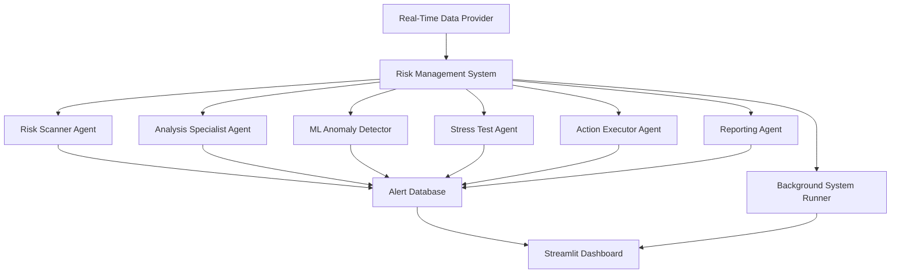

# 🏦 Autonomous Portfolio Risk Management System

[](https://www.python.org/downloads/)
[](https://streamlit.io/)
[](https://opensource.org/licenses/MIT)
[](https://github.com/psf/black)

> **Enterprise-grade autonomous portfolio risk management system with advanced machine learning, real-time monitoring, and comprehensive stress testing capabilities.**

https://finaagentai.streamlit.app/
## 🌟 Key Features

### 🤖 **Multi-Agent Architecture**
- **Risk Scanner Agent**: Real-time volatility and market risk detection
- **Analysis Specialist Agent**: Deep portfolio concentration and sector analysis
- **ML Anomaly Detector**: Machine learning-based market anomaly detection
- **Stress Test Agent**: Comprehensive scenario analysis and stress testing
- **Action Executor Agent**: Automated risk mitigation actions
- **Reporting Agent**: Intelligent alert aggregation and reporting

### 📊 **Advanced Analytics**
- **Risk Metrics**: VaR, Expected Shortfall, Maximum Drawdown, Sharpe/Sortino Ratios
- **Machine Learning**: Isolation Forest anomaly detection with feature engineering
- **Stress Testing**: Multiple scenario analysis (2008 crash, flash crash, rate shocks)
- **Correlation Analysis**: Dynamic correlation matrices and risk clustering
- **Technical Indicators**: RSI, MACD, Bollinger Bands integration

### 🎛️ **Real-Time Dashboard**
- **Interactive Streamlit Interface**: Professional multi-tab dashboard
- **Live Market Data**: Real-time price feeds and portfolio monitoring
- **Risk Heatmaps**: Visual risk assessment across assets and sectors
- **Alert Management**: Comprehensive alert filtering and analysis
- **Performance Tracking**: Portfolio performance visualization and metrics

## 🚀 Quick Start

### Prerequisites
```bash
Python 3.8+
pip (Python package manager)
```

### Installation

1. **Clone the repository**
```bash
git clone https://github.com/yourusername/portfolio-risk-management.git
cd portfolio-risk-management
```

2. **Install dependencies**
```bash
pip install -r requirements.txt
```

3. **Run the dashboard**
```bash
streamlit run main.py dashboard
```

4. **Access the application**
```
Open your browser to: http://localhost:8501
```

## 📦 Dependencies

```txt
streamlit>=1.28.0
pandas>=1.5.0
numpy>=1.21.0
yfinance>=0.2.0
plotly>=5.15.0
scikit-learn>=1.3.0
scipy>=1.9.0
requests>=2.28.0
ta>=0.10.2
networkx>=2.8.0
asyncio
sqlite3
threading
```

## 🎯 Usage Examples

### 1. **Dashboard Mode** (Recommended)
```bash
# Launch interactive dashboard
python main.py dashboard

# Or use Streamlit directly
streamlit run main.py dashboard
```

### 2. **Integrated Mode** (Dashboard + Background System)
```bash
# Run with background risk monitoring
python main.py integrated
```

### 3. **CLI Mode** (Headless Operation)
```bash
# Run command-line version
python main.py
```

### 4. **Programmatic Usage**
```python
from portfolio_risk_system import EnhancedRiskManagementSystem, Portfolio
import asyncio

# Create portfolio
portfolio = Portfolio(
    symbols=['AAPL', 'GOOGL', 'MSFT', 'TSLA'],
    weights={'AAPL': 0.25, 'GOOGL': 0.25, 'MSFT': 0.25, 'TSLA': 0.25},
    total_value=1000000.0
)

# Initialize system
risk_system = EnhancedRiskManagementSystem(portfolio)

# Run analysis
async def main():
    await risk_system.start_system()

asyncio.run(main())
```

## 🏗️ System Architecture



## 📊 Dashboard Overview

### **Main Tabs:**

1. **📊 Overview**
   - Portfolio metrics and KPIs
   - Real-time performance charts
   - Risk heatmap visualization
   - System status monitoring

2. **🚨 Risk Alerts**
   - Real-time alert feed
   - Alert filtering and search
   - Severity-based categorization
   - Historical alert analysis

3. **📈 Risk Metrics**
   - Advanced risk calculations
   - Correlation analysis
   - Volatility tracking
   - Performance attribution

4. **🧪 Stress Tests**
   - Scenario-based stress testing
   - Custom scenario creation
   - Impact visualization
   - Recovery analysis

5. **🤖 ML Analytics**
   - Anomaly detection results
   - Feature importance analysis
   - Model performance metrics
   - Predictive insights

## 🔧 Configuration

### **Portfolio Configuration**
```python
portfolio = Portfolio(
    symbols=['AAPL', 'GOOGL', 'MSFT', 'TSLA', 'NVDA'],
    weights={
        'AAPL': 0.20,
        'GOOGL': 0.20,
        'MSFT': 0.20,
        'TSLA': 0.20,
        'NVDA': 0.20
    },
    total_value=2000000.0,
    sector_allocation={
        'Technology': 0.80,
        'Other': 0.20
    }
)
```

### **Risk Thresholds**
```python
thresholds = {
    'volatility': 0.30,      # 30% annualized volatility
    'var_95': 0.05,          # 5% Value at Risk
    'correlation': 0.80,     # 80% correlation threshold
    'drawdown': 0.15,        # 15% maximum drawdown
    'concentration': 0.25    # 25% single position limit
}
```

### **ML Parameters**
```python
ml_config = {
    'lookback_period': 30,
    'contamination': 0.1,    # 10% expected anomaly rate
    'confidence_threshold': 0.8
}
```

## 🧪 Advanced Features

### **Custom Stress Scenarios**
```python
custom_scenario = {
    'equity_shock': -0.35,     # 35% market decline
    'vol_spike': 3.0,          # 3x volatility increase
    'correlation_increase': 0.3, # Correlation spike
    'recovery_time': 30        # Days to recovery
}
```

### **Machine Learning Features**
- **Technical Indicators**: RSI, MACD, Bollinger Bands
- **Volume Analysis**: Volume-price relationships
- **Momentum Indicators**: Price momentum and trend analysis
- **Volatility Metrics**: Rolling volatility and GARCH modeling

### **Risk Metrics Calculations**
```python
# Value at Risk (VaR)
var_95 = AdvancedRiskMetrics.calculate_expected_shortfall(returns, 0.05)

# Maximum Drawdown
max_dd = AdvancedRiskMetrics.calculate_max_drawdown(prices)

# Sharpe Ratio
sharpe = AdvancedRiskMetrics.calculate_sharpe_ratio(returns)

# Sortino Ratio
sortino = AdvancedRiskMetrics.calculate_sortino_ratio(returns)
```

## 📈 Performance Optimization

### **Data Caching**
- Intelligent market data caching
- Database query optimization
- Memory-efficient data structures

### **Asynchronous Processing**
- Non-blocking I/O operations
- Concurrent agent execution
- Background system monitoring

### **Resource Management**
- Automatic memory cleanup
- Connection pooling
- Efficient data serialization

## 🛡️ Risk Management Features

### **Alert Severity Levels**
- **CRITICAL**: Immediate action required
- **HIGH**: Urgent attention needed
- **MEDIUM**: Monitor closely
- **LOW**: Informational
- **INFO**: System notifications

### **Automated Actions**
- Position size adjustments
- Hedge recommendations
- Rebalancing suggestions
- Stop-loss triggers

### **Compliance & Monitoring**
- Real-time position monitoring
- Regulatory limit tracking
- Audit trail maintenance
- Performance reporting

## 🔍 Monitoring & Alerts

### **Real-Time Monitoring**
```python
# Portfolio monitoring
monitor_portfolio_value()
track_risk_metrics()
detect_limit_breaches()

# Market monitoring
scan_volatility_spikes()
detect_correlation_changes()
monitor_sector_rotation()
```

### **Alert Types**
- **HIGH_VOLATILITY**: Excessive asset volatility
- **CONCENTRATION_RISK**: Position size violations
- **SECTOR_CONCENTRATION**: Sector allocation limits
- **MARKET_ANOMALY**: ML-detected anomalies
- **STRESS_TEST_FAILURE**: Failed stress scenarios
- **CORRELATION_SPIKE**: High correlation events

## 📊 Data Sources

### **Market Data**
- **Yahoo Finance**: Real-time price data
- **Technical Analysis Library**: Indicator calculations
- **Custom APIs**: Alternative data sources

### **Risk Data**
- **Historical Prices**: Volatility calculations
- **Volume Data**: Liquidity analysis
- **Corporate Actions**: Dividend adjustments
- **Economic Indicators**: Macro risk factors

## 🚀 Deployment Options

### **Local Development**
```bash
streamlit run main.py dashboard
```

### **Docker Deployment**
```dockerfile
FROM python:3.9-slim

WORKDIR /app
COPY . .
RUN pip install -r requirements.txt

EXPOSE 8501
CMD ["streamlit", "run", "main.py", "dashboard"]
```

### **Cloud Deployment**
- **Streamlit Cloud**: Easy one-click deployment
- **AWS ECS**: Container-based deployment
- **Google Cloud Run**: Serverless deployment
- **Azure Container Instances**: Cloud container hosting

## 🤝 Contributing

We welcome contributions! Please see our [Contributing Guidelines](CONTRIBUTING.md) for details.

### **Development Setup**
```bash
# Clone the repository
git clone https://github.com/yourusername/portfolio-risk-management.git

# Create virtual environment
python -m venv venv
source venv/bin/activate  # On Windows: venv\Scripts\activate

# Install development dependencies
pip install -r requirements-dev.txt

# Run tests
pytest tests/

# Run linting
black . && flake8 .
```

## 📝 License

This project is licensed under the MIT License - see the [LICENSE](LICENSE) file for details.

## 🙏 Acknowledgments

- **Yahoo Finance API** for market data
- **Streamlit** for the amazing dashboard framework
- **Plotly** for interactive visualizations
- **scikit-learn** for machine learning capabilities
- **Technical Analysis Library** for financial indicators

## 📞 Support & Contact

- **Email**: yaxita2003@gmail.com

#
---

**Built with ❤️ for the financial technology community**

---

*⚠️ Disclaimer: This system is for educational and research purposes. Always consult with qualified financial professionals before making investment decisions.*
